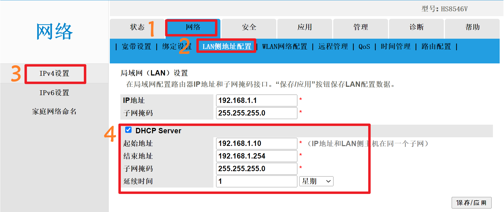
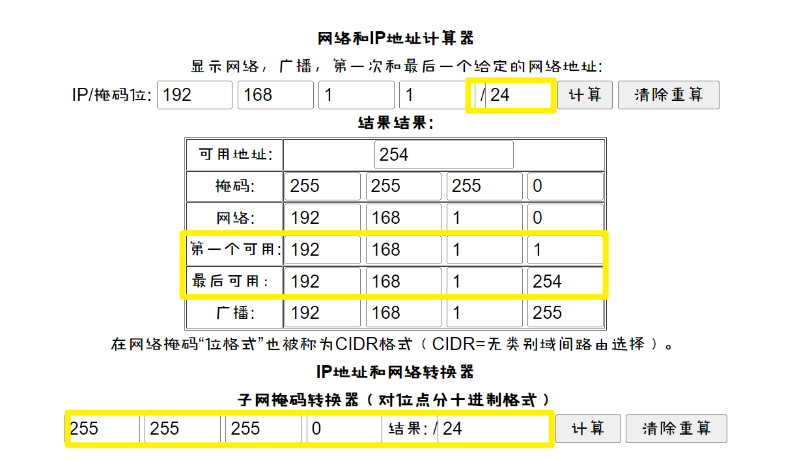
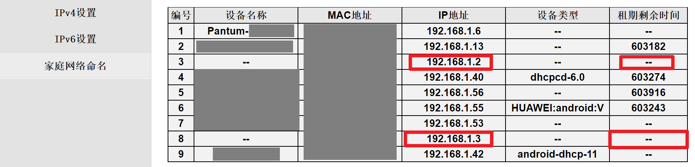

# 移动光猫(型号: HS8546V)设置静态地址

>HS8546V这个光猫有点老了，不好用还经常断线，不知道什么原因。
>
>由于Hk1 box安装了armbian系统，准备玩docker里的openWRT，所以要设置一下静态ip

## 登录光猫后台

```
192.168.1.1
账号：CMCCAdmin
root密码：aDm8H%MdA
//这个光猫个超管密码好像是大部分通用的，反正我是以前论坛里找的
```
打开IPv4设置，光猫反应有些慢



## 设置DHCP  

由于光猫没有直接绑定设备mac和ip的功能，那就直接把DHCP Sever 的分配范围割出来一部分，让设备自己静态设置

原理：

192.168.1.1/24有254个可用地址，去掉路由地址还有253个  
我们把DHCP Server的起始地址和结束地址范围缩小，腾出来一些没分配的IP就行了

>我将192.168.1.2-192.168.1.9腾出来给电脑和HK1box使用



## 设置设备的静态地址

>windows在网卡的属性中IPv4项设置  
>armbian用armbian-config

完成查看光猫，看到租`期剩余时间`已经没有了



## END
大功告成！